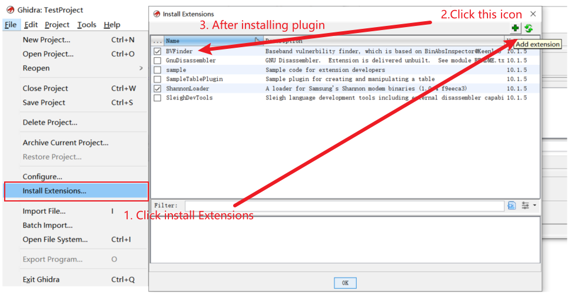

# What is BVFinder?

BVFinder is a baseband firmware static vulnerability prototype detection tool developed based on [BinAbsInspector](https://github.com/KeenSecurityLab/BinAbsInspector/tree/main). It identifies a vulnerability by locating whether a predefined sensitive memory operation is tainted by any attacker-controllable input. Specifically, to reach high automation and preciseness, it made two key improvements: a semantic-based taint source identification and an enhanced taint propagation. The former employs semantic search techniques to identify registers and memory offsets that carry attacker-controllable inputs. This is achieved by matching the inputs to their corresponding message and data types using textual features and addressing patterns within the assemblies.On the other hand, the latter technology guarantees effective taint propagation by employing additional indirect call resolution algorithms.


# Artifact Structure

> NOTE: Due to policy restrictions within our department, we are unable to provide the source code. Instead, we provide an initial version of the BVFinder plugin and will continue to update it in the future.(The plugin for Ghidra is in the ZIP format).

**Tools**

| **File**                                      | **Description**                                              |
| --------------------------------------------- | ------------------------------------------------------------ |
| shannonloader-1.0.4-f9eeca3-ghidra_10.1.5.zip | Ghidra plugin for load shannon baseband firmware.            |
| ghidra_10.1.5_PUBLIC_BVFinder.zip             | BVFinder tool provided as a Ghidra plugin.                   |
| logStringMatch.py                             | Python script used for matching debugging information and specification descriptions. |
| reverse/*                                     | Ghidra post-loading Python scripts that help annotate Shannon modem images. This includes recovering debug strings and auto-naming functions. Use after loading with ShannonLoader. **(Move these scripts to $USER_HOME$/ghidra_scripts).** These scripts are from [Grant-h](https://github.com/grant-h/ShannonBaseband/tree/master/reversing/ghidra/scripts). |
| script/*                                      | Script for quickly start.                                    |
| firmware/*                                    | Raw baseband firmware(CP_G960FXXS2BRH8).                     |

**Data**

| **Source**                                                   | **Description**                                              |
| ------------------------------------------------------------ | ------------------------------------------------------------ |
| https://sites.google.com/view/bvfinder-data                  | Historical vulnerability information collected.              |
| https://hub.docker.com/repository/docker/d0rz/bvfinder/general | Docker environment for BVFinder.                             |
| https://zenodo.org/records/10468116/files/CP_G960FXXS2BRH8_GhidraProjectItemFile.bin.gzf?download=1 | Exported ghidra project file of baseband firmware CP_G960FXXS2BRH8. |


## Self-Contain

We have made copies of all the external linked files mentioned in the readme document and included them in the repository as backups to ensure self-containment. However, the example file and Docker images exceeded the size limit for uploading to the code repository. Therefore, we have uploaded them to Docker Hub and Zenodo, and their MD5 and DOI links are provided below:

- DOI of Example File [](https://doi.org/10.5281/zenodo.10468116)
  - MD5 of *CP_G960FXXS2BRH8_GhidraProjectItemFile.bin.gzf* is ffda746ebf370a010a0f20e24a85ceef
  - MD5 of *ShannonLoader-1.0.4-f9eeca3-Ghidra_10.1.5.zip* is bf2b2d4f39aa792559048ba70b5d738d
- Docker image digest is 576fb1a053b6


# Install & Run

Firstly, you need to load the firmware into Ghidra and disassemble it. After that, run the installed BVFinder plugin. To achieve this, you can employ the following two approaches to load the baseband firmware for analysis:

- Import the disassembled Ghidra project file. (e.g., [example file](https://zenodo.org/records/10468116/files/CP_G960FXXS2BRH8_GhidraProjectItemFile.bin.gzf?download=1) )
- Utilize Shannonloader to load and execute a new firmware for disassembly.

## Installation

#### From Docker

We provide the docker environment of the tool, you can pull it directly by running the following command:

```c
sudo docker pull d0rz/bvfinder:0.1
```

Then start vncserver or us sshd to get ghidra's GUI.

```c
# get a bash 
sudo docker run -it d0rz/bvfinder:0.1 bash

# start sshd
/etc/init.d/ssh restart
```

Then run `ssh -X test@ip` in the external physical environment(all the default password is 123456). Afterwards, simply launch Ghidra 10.1.5 on the desktop, which has the plugins installed and the project file imported.

```c
cd ~
cd Desktop/ghidra_10.1.5_PUBLIC/
./ghidraRun    
```


#### From Repo

- [Github](https://github.com/KeepW4lk/BVFinder) or [Software Heritage](https://archive.softwareheritage.org/browse/origin/directory/?origin_url=https://github.com/KeepW4lk/BVFinder) 
-  Install Ghidra 10.1.5 released version according to [Ghidra's documentation](https://github.com/NationalSecurityAgency/ghidra#install) 

- - Install [ShannonLoader](https://github.com/grant-h/ShannonBaseband/tree/master/reversing/ghidra/ShannonLoader) to load samsung shannon firmware

-  Download the extension zip file from this repo (ShannonLoader and BVFinder). 

- - Start Ghidra and use the "Install Extensions" dialog (File -> Install Extensions...).
  - Press the + button in the upper right corner.
  - Select the zip file in the file browser, then restart Ghidra.

-  Download and import [exported ghidra project file](https://zenodo.org/records/10468116/files/CP_G960FXXS2BRH8_GhidraProjectItemFile.bin.gzf?download=1) or import [modem.bin](https://zenodo.org/record/6516030/) in for a new analyses. . 

NOTE: It is recommended to use the decompiled exported ghidra project file to quickly start analyse. 


## Load target and start analysis 

### Load

#### From the  Exported project of Ghidra

- Download example [project](https://zenodo.org/records/10468116/files/CP_G960FXXS2BRH8_GhidraProjectItemFile.bin.gzf?download=1).
- Start a GHIDRA project and click File » import file and select the downloaded example [project](https://zenodo.org/records/10468116/files/CP_G960FXXS2BRH8_GhidraProjectItemFile.bin.gzf?download=1).

#### From New Firmwares

- Download from [FirmWire Dataset](https://zenodo.org/record/6516030/)

If you want to analysis a new baseband firmware, you can use ghidra with shannonloader installed to load a raw baseband binary. You need to follow the steps below:

1. Make sure ghidra has the Shannonloader plugin installed. You can install it according to the steps in the *installation* Section.



1. Move reverse [scripts(ShannonTraceEntry.py, ShannonRename.py) ](https://github.com/grant-h/ShannonBaseband/tree/master/reversing/ghidra/scripts)to $USER_HOME$/ghidra_scripts.


1. Now start a new GHIDRA project and add a new file. Select the modem.bin file. You should see that this file's loader is automatically selected as "Samsung Shannon Modem Binary". If you do not see this, make sure that you have loaded the right file and installed the extension properly. Open GHIDRA debug console (bottom right on splash screen) to double check if there are any errors.


1. Import the file, let the loader finish and once again make sure there were no errors during loading.
2. Double click on the imported file to open CodeBrowser and hit **NO** to auto-analysis for now.
3. Now run the ShannonTraceEntry.py python script from Script Manager under the "Shannon" category. Make sure to either place scripts into your user home directory at ~/ghidra_scripts (Linux) or add the path to them in the manager. This script will identify all trace debugging information before analysis and avoid diassembling data.


1. Go to Analysis » Auto analyze..., and uncheck the "Non-returning Functions - Discovered" analyzer as this causes broken recovery of the log_printf function, leading to broken disassembly throughout the binary. If you do not uncheck this, you will need to restart your import from scratch.


1. Hit analyze and let GHIDRA churn away until it settles.
2. Next optionally run the auto-renamer script, ShannonRename.py. This will help you navigate the binary, but remember that the names are heuristically determined, so quality may vary. Functions with the same guessed name will have a numeric prefix appended.


### Analysis

The artifacts provided in the form of plug-ins cannot yet fully automate the entire analysis process (resolving indirect calls, identifying taint sources, and performing static analysis). To illustrate how to semi-automate the entire analysis process, we demonstrate the usability of BVFinder using a 0-day vulnerability case discovered in RQ3. 

Target: example [project](https://zenodo.org/records/10468116/files/CP_G960FXXS2BRH8_GhidraProjectItemFile.bin.gzf?download=1)(CP_G960FXXS2BRH8).

- Double-click on BinAbsInspector.java entry, then it will run the default analysis. **And you can right-click** ***Edit with basic editor\*** **to modify it.**
- When the analysis is done, you can see the out put on ghidra's console.

One of the zero-day vulnerabilities we discovered in RQ3 (which went through the patching process before being made public) was in the mm_SendMmcLteTo2G3GUeCapaCnfMsg function. In the example we provide, the address of this function is 0x40779790. The trigger path of the vulnerability is:

- mm_task(0x40d69c78)
- mm_Main__Message_1(0x40d69712)
- mm_DecodeMmcLteTo2G3GUeCapaReqMsg(0x4077995e), and it is an indirect call at mm_Main__Message_1@0x40d69ac6
- mm_SendMmcLteTo2G3GUeCapaCnfMsg(0x40779790)
- mm_CopyBufferBytes(0x407798b4) 

The simplified code snippet is  as follows:

```java
void mm_process()
{
	uint	msg_id;
	uint	msg_id;
	handler = (code * *) (&handler_list)[msg_id];
	(**handler)();                  /* handler_list[0xb3] -> mm_DecodeMmcLteTo2G3GUeCapaReqMsg() */
}


void mm_SendMmcLteTo2G3GUeCapaCnfMsg()              /* called by mm_DecodeMmcLteTo2G3GUeCapaReqMsg() */
{
	byte	buf[52];
	byte	* ie_ptr	= get_ptr();
	int	len		= get_len();
	mm_CopyBufferBytes( buf, ie_ptr, len );     /* lack IE length check */
}


void mm_RAURequest()
{
	int	len		= get_len();
	byte	* ie_ptr	= get_ptr();
	log( "MS Radio Access Capability ->" ); /* string for matching. */
}
```

In order to discover this vulnerability, we need to resolve the indirect calls, identify the taint source and perform a static taint analysis.

#### Step-1: Resolving Indirect call

You can test resolving indirect calls by replacing the analyze function in BinAbsInspector.java with the following code:

```java
protected boolean analyze() {
    //** Indirect Call resolving.
    GlobalState.icall = 1;
    if(GlobalState.icall == 1){
        Address fcontainsicall = GlobalState.flatAPI.toAddr(0x40d69712);
        BVFinder.resolveIncalls(fcontainsicall);
        for(Map.Entry<Address, Address> entry: GlobalState.icall_taints.entrySet()){
            println(entry.getKey().toString() + "  " + entry.getValue() + "");
        }
        analyzeFromAddress(fcontainsicall);
        return true;
    }
    return true;
}
```

And you will get the output like this and the target address(0x4077995e,mm_DecodeMmcLteTo2G3GUeCapaReqMsg) of the indirect call is in the output:

```java
BVFinder> [+] Resolving icall at 0x40d69712
BVFinder> icall target: 0x4077995e    // target handler function.
...
BinAbsInspector.java> Finished!
```

#### Step-2: Tag Taint Source

**Filter by data type**

```java
protected boolean analyze() {
		// ------- All APIs -------
        Function f = GlobalState.flatAPI.getFunctionAt(GlobalState.flatAPI.toAddr(0x4077995e));
        Set<Address> addresses = new HashSet();
        Set<Address> filtered = new HashSet();

        //** Collect Initial Taint Sources.
        BVFinder.getInitBinaryVars(f, addresses);
        println("[+] Number of initial taint variable:"+addresses.size()+"");

        //** filtered by DataRefer
        BVFinder.dataReference(addresses, filtered);
        println("[+] Number of taint variable after filtered by access mode: " + filtered.size());
        println("[+] Taint variable after filtered : " + filtered);
     	return true;
}
```

And you will get the output like this:

```java
BinAbsInspector.java> [+] Number of initial taint variable:15
BinAbsInspector.java> [+] Number of taint variable after filtered by access mode: 4
BinAbsInspector.java> [+] Taint variable after filtered : [40779b38, 416050d4, 416050e4, 40779b14]
```

**Filter by log strings.**

```java
protected boolean analyze() {
		// ------- All APIs -------
        Function f = GlobalState.flatAPI.getFunctionAt(GlobalState.flatAPI.toAddr(0x4077995e));
        Set<Address> addresses = new HashSet();
        Set<Address> filtered = new HashSet();

        //** Collect Initial Taint Sources.
        BVFinder.getInitBinaryVars(f, addresses);
        println("[+] Number of initial taint variable:"+addresses.size()+"");

        //** filtered by DataRefer
        BVFinder.dataReference(addresses, filtered);
        println("[+] Number of taint variable after filtered by access mode: " + filtered.size());
        println("[+] Taint variable after filtered : " + filtered);

        //** Collect Debug Strings.
        BVFinder.getMsgVariabledDebugInfo(filtered,"D:\\debugString2024.json");
        // use python script to filter this json file.
     	return true;
}
```

Then you will get a json file with debugging information collected under the specified path, its content looks like as follows:

```java
{"416050e4_40d54aca":"{mm_State -> %s   MM Service State -> %s   MM Update Status -> %s  in %sdeadbeef}",...}
```

After that, you can use the logStringMatch.py script to match the collected log information with the description in the specification:

```java
python3 .\logStringMatch.py 'D:\debugString2024.json'
```

Output:

```java
**********************************************
K=0.2
matched2_size: 4
matched2: {'0x40779b38', '0x40779b14', '0x416050d4', '0x416050e4'}
**********************************************
K=0.3
matched3_size: 4
matched3: {'0x40779b38', '0x40779b14', '0x416050d4', '0x416050e4'}
**********************************************
K=0.4
matched4_size: 2
matched4: {'0x416050d4', '0x416050e4'}
**********************************************
K=0.6
matched6_size: 2
matched6: {'0x416050d4', '0x416050e4'}
**********************************************
K=0.8
matched8_size: 2
matched8: {'0x416050d4', '0x416050e4'}
**********************************************
**********************************************
K=1
matched_size: 2
matched: {'0x416050d4', '0x416050e4'}
```

So finally we use global_0x416050d4 and global_0x416050e4 as the taint sources.

#### Step-3: Static Taint Analysis

##### check sensitive function

```java
protected boolean analyze() {
    Set<Address> addresses = new HashSet();
    GlobalState.check_funcs = true;
    Function memcpy = GlobalState.flatAPI.getFunctionAt(GlobalState.flatAPI.toAddr(0x40e73932)); // add sink function
    BasebandMemcpy.addstaticSymbols(memcpy.getName());
    addresses.clear();
    addresses.add(GlobalState.flatAPI.toAddr(0x416050d4));  // add taint source
    addresses.add(GlobalState.flatAPI.toAddr(0x416050e4));  // add taint source
    BVFinder.tagTaintSource(addresses);
    Address fcontainsicall = GlobalState.flatAPI.toAddr(0x40779790); // set start point
    return analyzeFromAddress(fcontainsicall);
}
```

After tagging the taint source filtered out through the above steps and set analysis entry, you can get the following output after running script:

```java
BinAbsInspector.java> Running solver on "mm_SendMmcLteTo2G3GUeCapaCnfMsg()" function
BVFinder> CWE121/122: Potential Buffer Overflow due to tainted input from source of FUN_4072ce48(FUN_4072ce48[0, 0, 0, 0, 0, 407798a4]) at inside of "mm_SendMmcLteTo2G3GUeCapaCnfMsg()" @ 407798b4
BVFinder> CWE121/122: Potential Buffer Overflow due to tainted input from source of mm_SendMmcLteTo2G3GUeCapaCnfMsg(mm_SendMmcLteTo2G3GUeCapaCnfMsg[0, 0, 0, 0, 0, 0]) at inside of "mm_SendMmcLteTo2G3GUeCapaCnfMsg()" @ 4077985a
BVFinder> CWE121/122: Potential Buffer Overflow due to tainted input from source of mm_SendMmcLteTo2G3GUeCapaCnfMsg(mm_SendMmcLteTo2G3GUeCapaCnfMsg[0, 0, 0, 0, 0, 0]) at inside of "mm_SendMmcLteTo2G3GUeCapaCnfMsg()" @ 407798e2
```

##### check loop

```java
protected boolean analyze() {
    Set<Address> addresses = new HashSet();
	GlobalState.check_loop = true;
    if(GlobalState.check_loop){
        println("  ************************ check loop.****************************");
        addresses.clear();
        addresses.add(GlobalState.flatAPI.toAddr(0x42b3d614));
        BVFinder.tagTaintSource(addresses);
        Address fcontainsicall = GlobalState.flatAPI.toAddr(0x408a8f86);
        boolean status = analyzeFromAddress(fcontainsicall);
        for(Address address: BVFinder.reported_loop_addr){
            println("Potential parsing IE via loop at" + " 0x" + address);
        }
        return status;
    }
    return true;
}
```

Output

```java
BinAbsInspector.java> Running...
BinAbsInspector.java>   ************************ check loop.****************************
BinAbsInspector.java> Running solver on "cc_HandleFacilityIEInSetupInd()" function
BinAbsInspector.java> Potential parsing IE via loop at 0x40876f2c    // FP
BinAbsInspector.java> Potential parsing IE via loop at 0x408a8ff0    // A N-day vulnerbility
BinAbsInspector.java> Finished!
```


### APIs

You can use or test the BVFinder interface by modifying **BinAbsInspector.java.** The original version we currently release supports the following functions:

| **API**                                                      | **Description**                                              |
| ------------------------------------------------------------ | ------------------------------------------------------------ |
| BVFinder.getInitBinaryVars(Function f, Set<Address> addresses) | Collect Initial Taint Sources within the given function and store their addresses to a set. |
| BVFinder.dataReference(Set<Address> addresses, Set<Address> filtered) | Filter taint sources based on access pattern of base address + offset. |
| BVFinder.resolveIncalls(Address func_addr)                   | Resolve indirect calls in the given function.                |
| BVFinder.getMsgVariabledDebugInfo(addresses,String path)     | Collect debugging information at the given address context and store them in json format to the given path. Subsequently use the logStringMatch.py script to match it with the message in the specification |
| BVFinder.tagTaintSource(Address addresses)                   | Mark a variable in the given set of addresses as a source of taint. |


# Find Vulnerbilities

The scripts was test on the example [project](https://zenodo.org/records/10468116/files/CP_G960FXXS2BRH8_GhidraProjectItemFile.bin.gzf?download=1). If you want to run BVFinder on a new baseband firmware, just follow the Step1-3 in **Analysis** section. Before running the script, you need to move these scripts in the following directory so that you can find and run them on Ghidra later.

```java
cd BVFinder
mv ./script/* ~/ghidra_scripts/
```

## Historical Vulnerability

| **Vulnerability** | **Location** |
| ----------------- | ------------ |
| BASESPEC-E6       | 0x40d3e0b0   |
| CVE-2020-25279    | 0x408a8a5e   |

Run the FindHistoricalVuls.java script on GUI mode of ghidra.


Output

```java
BinAbsInspector.java> Running solver on "mm_PerformPtmsiReallocation()" function
BVFinder> CWE121/122: Potential Buffer Overflow due to tainted input from source of FUN_40d3e024(FUN_40d3e024[0, 0, 0, 0, 40708842, 40d3e068]) at inside of "FUN_40d3e060()" @ 40d3e0b0
BVFinder> CWE121/122: Potential Buffer Overflow due to tainted input from source of FUN_40d3e024(FUN_40d3e024[0, 0, 0, 0, 4070886c, 40d3e068]) at inside of "FUN_40d3e060()" @ 40d3e0b0
BVFinder> CWE121/122: Potential Buffer Overflow due to tainted input from source of FUN_40d3e024(FUN_40d3e024[0, 0, 0, 0, 407088d0, 40d3e068]) at inside of "FUN_40d3e060()" @ 40d3e0b0
BinAbsInspector.java> Running solver on "cc_PerformBearerNegotiation()" function
BVFinder> CWE121/122: Potential Buffer Overflow due to tainted input from source of FUN_40d4079a(FUN_40d4079a[0, 0, 0, 0, 0, 408a8bba]) at inside of "cc_PerformBearerNegotiation()" @ 408a8bcc
BVFinder> CWE121/122: Potential Buffer Overflow due to tainted input from source of FUN_40d4079a(FUN_40d4079a[0, 0, 0, 0, 0, 408a8a4c]) at inside of "cc_PerformBearerNegotiation()" @ 408a8a5e
BinAbsInspector.java> Finished!
```

## New vulnerbility.

Use BVFinder to find one of the zero-day vulnerabilities we discovered in RQ3.

After running the FindNewVuls.java script on GUI mode of ghidra as done in previous section, you can get the following output:

```java
BinAbsInspector.java> Running solver on "mm_SendMmcLteTo2G3GUeCapaCnfMsg()" function
BVFinder> CWE121/122: Potential Buffer Overflow due to tainted input from source of FUN_4072ce48(FUN_4072ce48[0, 0, 0, 0, 0, 407798a4]) at inside of "mm_SendMmcLteTo2G3GUeCapaCnfMsg()" @ 407798b4
BVFinder> CWE121/122: Potential Buffer Overflow due to tainted input from source of mm_SendMmcLteTo2G3GUeCapaCnfMsg(mm_SendMmcLteTo2G3GUeCapaCnfMsg[0, 0, 0, 0, 0, 0]) at inside of "mm_SendMmcLteTo2G3GUeCapaCnfMsg()" @ 4077985a
BVFinder> CWE121/122: Potential Buffer Overflow due to tainted input from source of mm_SendMmcLteTo2G3GUeCapaCnfMsg(mm_SendMmcLteTo2G3GUeCapaCnfMsg[0, 0, 0, 0, 0, 0]) at inside of "mm_SendMmcLteTo2G3GUeCapaCnfMsg()" @ 407798e2
```


# Acknowledgement

We use Shannonloader, Ghidra and BinAbsInspector as our disassembly tool and data flow analysis framework, and our logStringMatch.py script uses the L3 message description information collected by the BASESPEC. Here we would like to thank them for their great work!